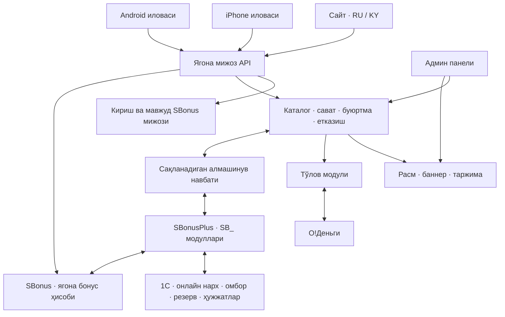

# Smart Centr — сайт, iOS, Android, 1С ва SBonus архитектураси

Версия: 1.0 — муҳокама ва кейинги лойиҳалаш учун ишчи асос. Сана: 10.09.2026.

Бу ҳужжат тайёр тизим ҳақида ҳисобот эмас: мавжуд коддан аниқланган ҳолат, қабул қилинган бизнес қарорлари ва қурилиши керак бўлган қисмларни ажратади. Ишлаб турган 1С, сервер, мижозлар, бонуслар ва тўловлар ўзгартирилмади. GitHub коди серверда айнан шу версия ишлаётганини исботламайди.

## 1. Сиз билан аниқланган қарорлар

| Масала | Қабул қилинган қарор |
|---|---|
| Бренд | Смарт Центр / Smart Centr; логотип ва ёзилиш дизайн босқичида бир хиллаштирилади |
| Ҳудуд | Бутун Қирғизистон |
| Тил | Русча ва қирғизча; мулоқот ва ушбу режа ўзбекча |
| Валюта ва вақт | KGS, интерфейсда «сом»; магазин вақти Asia/Bishkek |
| Домен | smarket.kg — рўйхатдан ўтказилган, фаол, 17.09.2027 гача; DNS Cloudflare орқали (A → 145.223.100.16). whitefitpro.com ҳозирча параллел ишлайди |
| Мижоз каналлари | Сайт + iPhone + Android; умумий очилишни бир вақтга режалаштириш |
| Тўлов | Мавжуд O!Деньги шартномаси ва тўлов ҳаволаси асосида |
| Товар манбаи | 1С; онлайн магазин учун алоҳида сотув нархи |
| Бонус | Мавжуд SBonus мижози ва ҳисоби сақланади |
| Рассрочка | Янги рассрочка фақат мавжуд SBonus клиентларига |
| Етказиш | Дўкондан олиб кетиш ёки ходим такси билан юбориш |
| Тунда | 1С компьютери ўчади; буюртма қабул қилинади, эрталаб товар тасдиқлангач тўланади |
| Материаллар | Фото, характеристика ва бренд материалларини асосан тайёрлаш керак |
| Бюджет | Бошланғич 100 USD; кейин қўшилиши мумкин |
| Иловалар дўкони | Apple Developer ва Google Play Console аккаунтлари бор |
| Очилиш санаси | Ҳали белгиланмаган; синов ва контент ҳажмидан кейин ҳисобланади |

Ишчи таклиф: рассрочка аризасини ходим тасдиқлайди. Мавжуд клиент бўлиш автоматик кредит тасдиғи эмас. Муддат, бошланғич тўлов, лимит ва шартнома тартиби амалдаги магазин қоидалари билан белгиланади.

## 2. Текширувда нима борлиги аниқланди

GitHub: [Bonus- репозиторийси](https://github.com/doniponis5-creator/Bonus-/tree/3e63ef19fc3aeca335f3d719ca3f1a67e390137e). Текширилган main commit: `3e63ef19fc3aeca335f3d719ca3f1a67e390137e`, 07.08.2026.

| Мавжуд қисм | Архитектурага таъсири |
|---|---|
| FastAPI backend, PostgreSQL, Redis, админ ва клиент кабинети | Янги тизимни мавжуд асос устида ривожлантириш мумкин |
| Мижоз ҳисоби, бонус ҳисоби, операциялар, акция ва қарзлар | Аккаунт ва бонусни бошқатдан яратмасдан қайта ишлатиш |
| WhatsApp орқали кириш коди | Кириш асоси бор; SMS захира йўли ва ҳимояни қўшимча тайёрлаш |
| `shop.py`, Order ва OrderItem | Каталог ва буюртма учун бошланғич код бор; router асосий маршрутларга уланмаган |
| SwiftUI + Capacitor iOS қобиғи, Android TWA файллари | Мобиль тайёргарлик бор; тўлиқ тайёр магазин иловалари деб ҳисобланмайди |
| O!Деньги тўлов модули ва 1С га тушумни узатиш | Асосан мавжуд рассрочка тўлови учун; янги товар буюртмасига алоҳида боғлаш керак |
| 1С дан товар, қолдиқ ва бонус алмашинуви; навбат модули | Шу механизмларни SBonusPlus ичида ривожлантириш мумкин |

Ишга туширишдан аввал тузатилиши шарт бўлган ҳолатлар:

- Маҳаллий август нусхасида товарнинг `price` майдонига таннарх узатилади. Онлайн нарх янги танланган 1С нарх туридан олиниши шарт; таннарх очиқ API га чиқмайди. [1С модули, 914-қатор](<D:/doonni/1С Предприятие/Базы/Смарт центр база/SBonusPlus_Extension/_AUDIT_CURRENT_PROD_20260831/CommonModules/SB_ОбщийМодуль/Ext/Module.bsl:914>)
- Қолдиқ омборлар бўйича жисмоний товарларни жамлайди. Бу ҳали «ҳозир сотиш мумкин» дегани эмас: омбор танлови ва банд қилинган товарлар ҳисобга олиниши керак.
- `shop.py` бошланғич коди ҳақиқий тўловдан олдин бонус балансини камайтиради; қолдиқ текшируви бир вақтдаги харидларга етарли эмас. Уни ўз ҳолича улаш мумкин эмас. [Текширилган shop.py](https://github.com/doniponis5-creator/Bonus-/blob/3e63ef19fc3aeca335f3d719ca3f1a67e390137e/sbonus-backend/app/api/v1/shop.py)
- Текширилган тўлов кодида сумма фарқи фақат қайд қилиниб, тасдиқлаш давом этади; callback имзосини текшириш функцияси тўлиқ бажарилмаган. Янги магазинда банкдан қайта текшириш, аниқ сумма/валюта/буюртма мослиги ва такрор хабардан ҳимоя мажбурий. Бу жорий сервер ҳолати ҳақида хулоса эмас. [Маҳаллий тўлов коди](<D:/doonni/1С Предприятие/Базы/Смарт центр база/SBonusPlus_Extension/ONLINE_PAYMENTS/backend/payments_router.py:450>)
- Эски йўриқномалар ва конфигурация нусхалари турли версияларни кўрсатади. Фаол база, конфигурация, SBonusPlus ва МЛ подпискалари кодлашдан олдин аниқланади. Айниқса иккала кенгайтмадан бонус икки марта ишламаслиги текширилади.

## 3. Тизимнинг умумий тузилиши

Мижоз учун бу битта магазин: телефонда бошлаган харидини сайтда давом эттиради. Учала канал бир хил нарх қоидаси, буюртма рақами, аккаунт ва бонусдан фойдаланади. Расмлар тез тарқатиш хизмати орқали юкланади; ҳар бир саҳифани очиш 1С га сўров юбормайди.

1С файли интернетга чиқарилмайди. Дўкон томонидаги алмашинув воситаси ҳимояланган HTTPS орқали серверга мурожаат қилади. Буюртмалар серверда сақланади ва 1С ишга тушганда қайта ишланади.

## 4. Қайси маълумотга ким жавоб беради

| Маълумот | Асосий манба | Қоида |
|---|---|---|
| Товар ва вариант идентификатори | 1С | Доимий UUID; код ва штрихкод ёрдамчи майдон |
| Онлайн сотув нархи | 1С даги танланган нарх тури | Админда иккинчи мустақил нарх юритилмайди |
| Омбор ва резерв | 1С | Сайтдаги нусха вақт ва версия билан келади |
| Буюртма | Магазин сервери | 1С ҳужжати билан ягона боғланиш сақланади |
| Бонус ҳисоби ва тарихи | SBonus | Сайт/илова балансни ўзича ҳисоблаб ёзмайди |
| Тўловнинг ҳақиқий ҳолати | O!Деньги | Сервер банк жавобини текшириб сақлайди |
| Фото, видео, тавсиф, таржима, баннер | Админдаги контент бўлими | 1С синхронизацияси буларни ўчирмайди |
| Акция ва промокод | Сервердаги акция қоидалари | Нархга таъсири буюртма ва 1С ҳужжатида сақланади |
| Рассрочка графиги ва қарз | 1С / мавжуд SBonus интеграцияси | Фақат шу мижознинг шахсий кабинетида |

Базавий онлайн нарх 1С дан келади. Кампания ёки промокод чегирмаси серверда қўлланса, унинг қоидаси ва сумма тақсимоти 1С га ҳам узатилади. 1С ҳужжати ва клиент тўлаган сумма бир-бирига мос бўлиши шарт.

## 5. Оддий харид қандай ўтади

1. Мижоз рўйхатдан ўтмасдан товарларни кўради, қидиради, таққослайди ва саватга қўшади.
2. Буюртма беришда телефон рақамини тасдиқлайди. Мавжуд SBonus ҳисоби бўлса шу ҳисоб очилади; янги мижоз учун янги ҳисоб бир марта яратилади.
3. Дўкондан олиб кетиш ёки етказишни танлайди. Етказиш учун шаҳар/қишлоқ, манзил ва алоқа рақами олинади.
4. Сервер товар варианти, онлайн нарх, акция, бонус лимити ва етказишни қайта ҳисоблайди. Браузердан келган тайёр суммага ишонмайди.
5. 1С ишлаётганда товар резерви тасдиқланади. Етказиш нархи ҳали номаълум бўлса, ходим уни ҳам аниқлайди.
6. Мижоз товарлар, чегирма, бонус ва етказиш ажратилган якуний суммани кўради ва тасдиқлайди. Сервер товар резерви ҳали амал қилишини текширади ва бонусни вақтинча банд қилади. Иккаласи ҳам муваффақиятли бўлгандан кейингина муддатли тўлов ҳаволаси берилади. Ҳисоб яратиш хато бўлса, натижаси номаълум банк уриниши аввал текширилади; аниқ яратилмаган ҳисобнинг резерв ва бонус банди бўшатилади.
7. Банк тўловни тасдиқласа, сервер бонусни бир марта ечади ва буюртмани «тўланган»га ўтказади. Банкдан жавоб кутилаётган пайтда бонус банди асоссиз бўшатилмайди.
8. Ходим йиғади, текширади ва мижозга беради ёки таксига топширади. Мижознинг қабул қилиши алоҳида тасдиқланади.
9. Янги бонус таклиф қилинган қоида бўйича товар топширилгандан кейин начисление қилинади. Бу қоида мавжуд SBonus сиёсати билан келиштирилади; 1С ва магазин бир сотувга икки марта начисление қилмайди.

Масалан, фақат ҳисобни тушунтириш учун: товар 10 000 сом, акция 500 сом, ишлатилган бонус 1 000 сом, етказиш 300 сом бўлса, банкка тўлов 8 800 сом. Бонус фақат товарнинг рухсат этилган қисмига ишлайди; етказишга қўлланиши алоҳида қоидасиз ёқилмайди.

## 6. Тунда ва алоқа узилганда

Сиз танлаган режим: тунда каталог, сават, кабинет ва буюртма қолдириш ишлайди. Матн аниқ бўлади: «Буюртмангиз қабул қилинди. Дўкон очилганда мавжудликни тасдиқлаб, тўлов ҳаволасини юборамиз».

- Тунги буюртма ҳали кафолатланган резерв эмас. Карточкада эски қолдиққа асосланган «аниқ бор» ваъдаси берилмайди.
- Эрталаб 1С дан янги нарх ва қолдиқ олинади, товар банд қилинади, ходим етказишни тасдиқлайди.
- Нарх ёки таркиб ўзгарган бўлса, мижозга янги якуний ҳисобни тасдиқлатамиз. Олдинги ҳисобни яширинча алмаштирмаймиз.
- Тўлов бошланмаган тунги буюртма учун бонус узоқ вақтга банд қилинмайди. Эрталаб тўлов ҳисобини тайёрлашда қайта текширилади.
- Тўлов ҳаволаси, товар резерви ва бонус банди муддатлари мувофиқлаштирилади. Муддат тугашида банк ҳолати қайта аниқланади. Банд бўшатилгандан кейин пул келса, янги резерв/бонус ечими фақат қайта текширув билан; етмаган бонус мажбуран манфий қилинмайди. Бундай буюртма ходим кўригига ўтади, мижоз билан янги ҳисоб ёки пул қайтариш келишилади.
- Иш вақтида ҳам 1С алоқаси йўқолса, автоматик шу режимга ўтилади. Мавжуд банк ҳаволаси кечикиб тўланса, уни бекор бўлган деб йўқотмаймиз: тўлов сақланади, товар/резерв қайта текширилади, керак бўлса қайтариш иши очилади.
- Бонус хизмати ишламаса, ишончсиз балансдан ечилмайди. Мижоз бонуссиз қайта ҳисобни ўзи қабул қилиши ёки кутиши мумкин. 1С да оддий ҳужжат ўтказиш API хатоси сабаб тўхтамайди.

## 7. 1С учун SBonusPlus қўшимчалари

Барча янги 1С код ва метамаълумот объектлари SBonusPlus ичида, `SB_` префикси билан. Асосий конфигурация модуллари таҳрирланмайди, база файлига ва SQL орқали тўғридан-тўғри ёзилмайди. Код шарҳлари русча бўлади.

Режалаштириладиган имкониятлар:

- «Онлайн магазин» созламалари: онлайн нарх тури, сотув омборлари, иш вақти, алмашинув ҳолати.
- Товарни сайтда чиқариш белгиси; вариант, ранг, хотира/ўлчам ва бирликларни мослаштириш.
- Товар, онлайн нарх ва сотиш мумкин бўлган қолдиқни алоҳида пакетлар билан юбориш.
- Кирувчи интернет буюртмаларини кўриш, тасдиқлаш, рад қилиш ва боғланган ҳужжатга ўтиш.
- Резерв, тўлов, сотув, бекор қилиш ва қайтариш ҳолатларини алмашиш.
- Муаммоли алмашинувни кўриш ва хавфсиз қайта юбориш; барча ҳаракатлар журнали.

Резерв асосий 1С сотув жараёни ҳам ҳисобга оладиган стандарт механизм орқали бажарилиши шарт. Фақат янги `SB_` регистрида «банд» деб белгилаш кассирнинг шу товарни сотишини автоматик тўхтатмайди. Аниқ стандарт API/ҳужжат фаол конфигурацияга қараб тест нусхада танланади. Ишчи резерв/сотув ҳужжатлари яратилиши реал ҳисобга таъсир қилади; шунинг учун бу кейинги амалга ошириш ва синов босқичининг алоҳида иши.

Қолдиқ: танланган омборлардаги сотишга рухсат этилган миқдордан ҳисобга олинмаган резервлар айирилади. 1С қолдиғи резервни аллақачон айирган бўлса, сервер уни иккинчи марта айирмайди. Буюртманинг бир хил SKU қаторлари аввал жамланади; бир дона қолган товарни бир вақтда икки мижозга резервлашдан транзакция билан ҳимоя қилинади.

Алмашинув мақсадлари, ҳали ўлчанмаган: иш вақтида ўзгаришдан кейин 30–60 секундда қолдиқ; нарх учун 1–5 минут; кечиккан хабарлар учун даврий қайта солиштириш. Аниқ интервал база ҳажми ва юклама синовидан кейин танланади. Нолга тушган қолдиқ, ўчириш белгиси ва эски версиядаги хабар ҳам тўғри қайта ишланиши шарт.

## 8. Бонус йўқолмаслиги учун

Мақсад — мавжуд баланс ва тарихни сақлаш, нотўғри/такрор ечишни тўхтатиш ва хатодан тиклаш. «Ҳеч қачон хато бўлмайди» деган кафолат ўрнига текшириладиган механизмлар қўйилади.

- **Битта ҳисоб:** мавжуд SBonus `customer_id` ва бонус ҳамёни сақланади. Сайт учун параллел ҳамён очилмайди.
- **Банд қилиш:** тўлов бошланганда бонус hold сифатида вақтинча ажратилади; у бошқа сайт/илова/касса харидида қайта ишлатилмайди. Буни SBonus’нинг барча ечиш йўллари, жумладан 1С ва кассир, ҳисобга олиши керак.
- **Тўловдан кейин:** пул тасдиғига боғланган ҳолда hold ечимга айланади. Бекор бўлса бўшайди. Ҳамёнга икки параллел сўров битта транзакцион ҳимоядан ўтади.
- **Тарих:** ҳар бир начисление, ечиш, қайтариш ва тузатиш алоҳида ёзув. Эски операцияни ўчириб балансни тўғрилаш ўрнига боғланган компенсация ёзуви қилинади.
- **Бир сотув — бир натижа:** магазин буюртмаси, 1С ҳужжати, банк тўлови ва бонус операцияси ягона боғланишга эга. Тугма қайта босилиши ёки хабар такрор келиши янги начисление яратмайди.
- **Қайтариш:** қисман қайтаришда айнан қайтарилган товарга тақсимланган бонус ва пул ҳисобланади. Олинган бонус аллақачон сарфланган бўлса, амалдаги сиёсат ва ходим кўриги қўлланади; яширин баланс тузатиши қилинмайди.
- **Қоидалар:** ҳозирги 30% лимит, даражалар, истисно товарлар ва бонус муддати сервердан олинади. Янги начисление шу буюртманинг ўзида сарфланмайди. Миграция бонус муддатларини ўзбошимчалик билан ўзгартирмайди.
- **Назорат:** баланс билан операциялар журнали мунтазам солиштирилади; очиқ hold, етмаган ечим ва такрор receipt алоҳида текширилади. Уведомление маълумот сақлангандан кейингина навбатдан юборилади.

## 9. O!Деньги тўлови

Сизда шартнома ва маҳаллий интеграция бор. Шуни текшириб ривожлантирамиз; янги провайдерга ўтиш талаб қилинмайди. O!Business расмий саҳифаси тўлов ҳаволаси ва тайёр банк танлаш саҳифасини тасдиқлайди. [O!Business](https://obank.kg/ru/for-business/business-management)

Ҳар бир ҳисоб учун: ички буюртма рақами, тўлов уриниши рақами, банк invoice рақами, аниқ сумма, KGS, муддат ва ҳолат сақланади. Бир буюртмада бир неча уриниш бўлиши мумкин, лекин такрор тўланган пул ҳам йўқолмасдан алоҳида кўрилади.

Тасдиқ қоидалари:

1. Браузернинг «тўладим» тугмаси, screenshot ва қайтиш саҳифаси пул тушганини исботламайди.
2. Callback банкнинг келишилган протоколи бўйича текширилади; банк API орқали invoice/тўлов ҳолати қайта олинади. Мерчант, сумма, валюта ва буюртма мос келмаса автоматик «тўланган» қилинмайди.
3. Хабар аввал ишончли сақланади, кейин ишланади. Такрор callback, тартибсиз келган ҳолатлар ва сервер қайта ёқилиши ҳисобга олинади.
4. Callback келмаса, сервер очиқ тўловларни банкдан қайта сўрайди. Ҳолати номаълум тўлов муваффақиятсиз деб шошилиб ёпилмайди.
5. Пул тушган, лекин 1С қабул қилмаган ҳолат «тўланган, 1С га узатиш кутилмоқда» бўлади; мижоздан қайта тўлов талаб қилинмайди.
6. Пул қайтариш, бонус қайтариш ва омборга қайтариш алоҳида ҳолатларда юритилади; қайтариш сўрови берилгани пул қайтгани билан тенглаштирилмайди.

Очиқ расмий API спецификация бу текширувда топилмади. Мавжуд мерчант техник ҳужжатидан имзо, пул бирлиги (сом/тийин), тўлов муддати, callback, қисман қайтариш ва реестр шартларини тасдиқлаш керак. Тўлов провайдери квитанцияси автоматик фискал чек деб қабул қилинмайди; чек тартиби магазин бухгалтери ва амалдаги ККМ хизмати билан аниқланади.

## 10. Кириш — осон, лекин бонус ҳимояланган

Ишчи тавсия: телефон рақами + бир марталик код. Парол эслаш ва мажбурий email талаб қилинмайди. Мавжуд WhatsApp кириш механизмини ривожлантириб, SMS захира канали қўшилади; SMS провайдери ҳали танланмаган.

- Каталог, қидирув ва сават учун кириш шарт эмас. Код буюртма бериш ёки шахсий маълумотни очишда керак.
- Кодда муддат, қайта юбориш ва уриниш лимити бўлади; бир марта ишлайди. Мавжуд 4 рақамли кодни кучайтириш, жумладан 6 рақамли вариантни жорий қилиш режалаштирилади.
- Мижозга телефон рақами мавжуд/мавжуд эмаслигидан бошқа инсон ҳақида маълумот очилмайди.
- Тасдиқланган телефон мавжуд SBonus ҳисоби билан боғланади. Дубликат/баҳсли эски рақамларни автоматик қўшиб юбормаймиз; оператор тиклаш жараёни бор.
- Янги телефон эгасига эски мижознинг бонуси ва қарзини бериб юбормаслик учун рақам алмаштириш, қайта сотилган SIM ва шубҳали киришда қўшимча текширув бўлади.
- Янги рўйхатдан ўтишда welcome/referral бонуси телефон тасдиқлангандан кейин бир марта берилади. Эски бонуслар кўчиришда қайта начисление қилинмайди.
- Кейинги киришда хавфсиз сессия сақланади. Мобиль токенлар системанинг ҳимояланган сақлаш жойида, веб сессияси HttpOnly cookie орқали; телефондаги Face ID/биометрика қўшимча қулайлик бўлиши мумкин.
- Оддий товар хариди учун паспорт, ИНН ва клиент фотоси сўралмайди. Рассрочка маълумотлари алоҳида чекланган жараёнда очилади.

## 11. Фақат мавжуд SBonus клиентларига рассрочка

«SBonus да ёзуви бор» деган текширувнинг ўзи етарли эмас: янги сайт мижози ҳам рўйхатдан ўтиши билан SBonus клиентига айланади. Шунинг учун алоҳида **рассрочкага ариза бериш ҳуқуқи** керак.

Ишчи тартиб: аввалдан мавжуд ва ходим тасдиқлаган мижозларга ҳуқуқ белгиланади. Ушбу белгини оддий рўйхатдан ўтиш ёки мижознинг ўзи ўзгартира олмайди. Ким «мавжуд клиент» ҳисобланиши — олдинги харид/шартнома/ходим текшируви асосида — магазин билан аниқлаштирилади.

Рухсатли мижоз товарни танлайди → шартлар ва олдиндан ҳисобни кўради → ариза қолдиради → ходим амалдаги қарз, лимит ва ҳужжатларни текширади → якуний шартни тасдиқлайди → шартнома ва товар бериш жараёни бажарилади. Онлайн ариза имзоланган шартнома ўрнига ўтмайди. Автоматик кредит бериш ва ҳуқуқий электрон имзо биринчи версияда ўз-ўзидан ёқилмайди.

Мавжуд график, кейинги тўлов, қолган қарз ва O! орқали тўлаш имконияти SBonus кабинетида сақланади. Бу маълумотлар оммавий товар API сига чиқмайди.

## 12. Товарлар, акциялар ва ишонч

Биринчи тўлиқ сотув версиясига киритилади:

| Бўлим | Функциялар |
|---|---|
| Бош саҳифа | Асосий баннер, категория, ҳақиқий акция, оммабоп ва янги товарлар, етказиш ва кафолат маълумоти |
| Каталог | Русча/қирғизча қидирув, бренд ва модель, категорияга мос фильтр, саралаш, сақланган товар, таққослаш |
| Товар карточкаси | Аниқ вариант, сифатли галерея, зум, характеристика, комплектация, кафолат, мавжудлик ва етказиш ҳолати |
| Нарх | Онлайн нарх, ҳақиқий чегирма, бонус билан тўлаш мумкин бўлган сумма, якуний ҳисоб |
| Сават | Вариант ва сонни ўзгартириш, промокод, бонус, қайта ҳисоб, етишмаётган товар ҳақида аниқ хабар |
| Кабинет | Профиль, буюртмалар ва ҳолатлар, бонус тарихи, сақланган товарлар, манзиллар, қайтариш сўрови |
| Рассрочка | Ҳуқуқли мижозга ариза; мавжуд қарз ва графикка хавфсиз кириш |
| Қўллаб-қувватлаш | Телефон/WhatsApp алоқаси, иш вақти, дўкон манзили, харита ҳаволаси, буюртма бўйича савол |
| Ишонч | Реал магазин реквизитлари, қайтариш ва кафолат шартлари, тўлов усули, ҳақиқий отзывлар |
| Хабарлар | Буюртма тасдиғи, тўлов, товар тайёрлиги, етказиш, қайтариш; рекламага розилик алоҳида |

Акциялар: муддат, товар/категория, фоиз ёки сумма, умумий лимит, бир клиентга лимит ва бонус билан қўшилиш қоидаси. Бир вақтдаги промокод ишлатиш лимитни ошиб кетмайди. Буюртмада акция қоидаси ва чегирманинг ҳар бир товарга тақсимоти сақланади.

Фото ва характеристика манбаи: айнан модель ва рангга мос ишлаб чиқарувчи/етказиб берувчи материаллари, фойдаланиш ҳуқуқи билан; етишмаганларига магазиннинг ўз фотоси. AI баннер фони ва ғояси учун ишлатилиши мумкин, аммо товарнинг ўзи ва характеристикаси уйдирилмайди. Сохта отзыв, ёлғон саноқ ёки тасдиқланмаган «охирги 1 дона» берилмайди.

Ҳар бир товар учун: RU/KY ном, тавсиф, категория, бренд, вариант, техник параметрлар, кафолат ва камида асосий расм. Фотолар автоматик кичрайтирилган форматларга ўгирилади; катта оригиналлар ҳар саҳифа очилишида юкланмайди. Баннернинг матни расмга ёпиштирилмасдан икки тилда алоҳида бошқарилади.

## 13. Такси ва дўкондан олиб кетиш

Бутун Қирғизистон савдо ҳудуди бўлади, аммо ҳар бир манзилга нарх ва муддат ходим тасдиғидан кейин берилади. Ҳозирги такси жараёнига тўғри келмайдиган автоматик «ҳамма жойга эртага етказамиз» ваъдаси қўйилмайди.

Админ кўради: манзил, олувчи, алоқа, йўналиш, етказиш нархи, ким тўлайди, режалаштирилган сана, ҳайдовчига берилган вақт, қабул тасдиғи. Товар пули ва етказиш пулини қай тарзда олиш буюртма тўловидан олдин белгиланади. Биринчи версия учун якуний етказиш суммасини аввал тасдиқлаш тавсия қилинади.

«Таксига берилди» ва «клиент қабул қилди» икки хил ҳолат. Қабул код ёки оператор тасдиғи билан қайд қилинади. Буюртма тайёрлиги, олмай қолиш, бекор қилиш ва шикастланган товар учун мурожаат тартиби мавжуд бўлади. Ҳайдовчига бонус баланси, паспорт ёки қарз маълумоти берилмайди.

## 14. Сайт ва иловаларнинг дизайни

10.09.2026 тасдиқланган дизайн: мижоз «01 · Кўк + лайм» вариантини танлади. Оқ фон `#FFFFFF`, ёрқин кўк асосий тугмалар `#245BEB`, лайм SBonus акцентлари `#D9F86D`, енгил кўк фон `#F1F5FF`, асосий матн `#142334`. Кўк тугмада оқ ёзув, лайм фонда тўқ ёзув бўлади. Қора-голд ранг йўналиши қўлланмайди. Ушбу палитра сайт, iOS ва Android учун умумий бренд асосидир. Тугмалар босилишига қисқа жавоб ва сават миқдори ўзгариши кўрсатилади; доимий пульсация қилинмайди. Аниқ экранлар, тугма геометрияси ва анимация тафсилотлари кейинги дизайн босқичида кўриб чиқилади.

Умумий бренд: бир логотип, асосий ранг, маҳсулот фотоси услуби, карточка тартиби, иконкалар маъноси ва харид босқичлари. Тавсия қилинган асосий навигация: Бош саҳифа, Каталог, Сават, SBonus, Профиль. Сайт катта экранга мослашади; мобиль версия бир қўл билан ишлашга қулай бўлади.

Apple расмий саҳифаси iOS 27 ва Liquid Glass йўналишини кўрсатади. Текширув санасида саҳифада умумий чиқиш 14 сентябрь деб берилган. Мақсад — ишга тушириш вақтидаги барқарор SDK ва қўллаб-қувватланадиган қурилмаларда синов. [Apple iOS](https://www.apple.com/os/ios/)

iOS да ойнасимон эффект асосан навигация ва бошқарувларда; товар сурати, нархи ва тўлов матни аниқ фонда. Apple материаллар қўлланмаси ҳам контент қатлами билан бошқарув қатламини ажратади. [Apple Materials](https://developer.apple.com/design/human-interface-guidelines/materials)

Android да Material 3 Expressive: тушунарли тугмалар, мос шакл ва ҳаракат, платформага табиий навигация. [Material 3](https://m3.material.io/)

Анимация: саватга қўшиш, экранлар ўтиши, товар галереяси ва ҳолат ўзгаришида қисқа ва маъноли. Доим айланувчи ёки харидни секинлаштирувчи эффектлар қўшилмайди. Ҳаракатни камайтириш созламаси, катта матн ва экран ўқувчи қўллаб-қувватланади. Қирғизча Ң/Ө/Ү ҳарфлари алоҳида текширилади. Веб учун WCAG 2.2 AA сифат мақсади қабул қилинади. [W3C](https://www.w3.org/TR/WCAG22/)

Дизайндан олдин тайёрланадиган экранлар рўйхати: бош саҳифа, каталог, товар, сават, код билан кириш, тўлов, тунги буюртма, бонус ҳисоби, буюртма тарихи, рассрочка аризаси. Кейин бир нечта ҳақиқий товар билан сайт/iOS/Android намунаси бирга кўриб чиқилади.

## 15. Технология ва бюджетга мос амалга ошириш

Сервер учун ишчи танлов: мавжуд FastAPI, PostgreSQL ва Redis асосини сақлаб, каталог/буюртма/етказишни чегаралари аниқ модуллар сифатида ривожлантириш. Бонус ҳисоблаш фақат ягона loyalty хизмат қатламида; `shop.py` балансни тўғридан-тўғри таҳрирламайди. Критик фон ишлари хотирадаги task билан чекланмайди — PostgreSQL да сақланган outbox/inbox ва қайта ишлаш навбати бўлади.

Сайт учун Next.js асосини ривожлантириш тавсия қилинади: каталог саҳифалари сервердан тайёр HTML билан, сават ва интерактив ҳаракатлар браузерда. Мавжуд эски версиялар хавфсизлик ва мослик аудити билан янгиланади, рақамлар кўр-кўрона маҳкамланмайди. [Next.js расмий қўлланма](https://nextjs.org/docs/app/getting-started/server-and-client-components)

Мобиль интерфейс бўйича қарорнинг икки йўли бор; API архитектураси иккаласига ҳам мос:

| Йўл | Натижа | Чегараси |
|---|---|---|
| Мавжуд веб интерфейс + Capacitor/платформа қобиғини ривожлантириш | Экранларни кўпроқ қайта ишлатиш, учала канални бирга юритишга камроқ иш | Барча контент автоматик тўлиқ native бўлмайди; iOS 27 ва Android эффекти алоҳида синовдан ўтади |
| iOS SwiftUI + Android Kotlin/Compose | Платформага энг табиий бошқарув ва янги системавий дизайн | Иккита тўлиқ мобиль интерфейсни қуриш ва қўллаб-қувватлаш керак |

Бошланғич бюджет ва мавжуд кодни ҳисобга олган ишчи тавсия — биринчи йўлнинг товар/сават/тўлов намунасини текшириш. Агар у сиз истаган сифатга етмаса, дизайнни тўлиқ қуришдан олдин native йўл танланади. Тўлиқ native сифатни оддий веб қобиғи деб тақдим қилмаймиз. Икки ҳолатда ҳам сайт ва иловаларни умумий очилишга тайёрлаш режаси сақланади.

100 USD — бутун лойиҳанинг кафолатланган нархи эмас, бошланғич харажат чегараси. Мавжуд сервер ва аккаунтлар қайта ишлатилади, агар сиғим ва ҳуқуқлари етарли бўлса. Янги пуллик сервисга ҳозир обуна қилинмади. Ҳисобланадиган харажатлар: сервер сиғими, ташқи backup, фото сақлаш/трафик, SMS, дизайн/контент, iOS қуриш учун macOS муҳити ва қурилма синови. Apple аъзолиги вақти келганда янгиланади; мавжуд аккаунт борлиги кейинги йил харажатини йўқ қилмайди. [Apple аъзолиги](https://developer.apple.com/support/compare-memberships/)

## 16. Админга осон иш жойи

Мавжуд админ панелини кенгайтириш — тавсия; ходимга иккинчи бонус панели керак эмас.

- **Буюртмалар:** янги, тасдиқ кутилмоқда, тўлов кутилмоқда, тўланган, йиғилмоқда, берилган, етказилган, бекор ва қайтариш.
- **Товарлар:** 1С онлайн нархи ва охирги алмашинув вақти; фото/тавсиф/таржима; сайтда чиқариш. Етишмаган контентни кўрсатиш.
- **Акциялар:** баннер, товар рўйхати, бошланиш/тугаш, промокод ва бонус билан қўшилиш; аввалдан кўриб чиқиш.
- **Тўлов:** банкда тасдиқланган, номаълум, сумма мос эмас, 1С га ўтмаган, қайтариш кутилмоқда; хавфсиз қайта текшириш.
- **SBonus:** мавжуд баланс ва тарих; асоссиз тўғридан-тўғри баланс таҳрири берилмайди.
- **Рассрочка:** ҳуқуқ ва ариза; ходим қарори ва сабаби қайд қилинади.
- **Алоқа:** 1С ишлаяптими, қанча хабар кутиляпти, охирги муваффақиятли алмашинув, хатони қайта ишлаш.
- **Ҳисобот:** тўланган буюртма, бекор, қайтариш, товар ва етказиш тушуми, бонус билан тўлов. SBonus начисление суммаси сотув тушуми билан аралаштирилмайди.

Янги магазин роллари: раҳбар, буюртма ходими, контент ходими, бухгалтер/қайтариш масъули. Мавжуд 1С фойдаланувчилари ва ҳуқуқлари бу режалаштиришда ўзгартирилмайди. Ҳар бир ходимга фақат вазифаси учун зарур майдон ва амаллар берилади.

## 17. Техник маълумотлар шартномаси

Бу бўлим кейин код ёзадиган мутахассис учун; endpoint номлари ҳозир ишлаб турган API деб ҳисобланмайди.

| Сущность | Зарур маълумот |
|---|---|
| Мижоз боғланиши | SBonus customer UUID, тасдиқланган телефон, сессия, розилик версияси; телефон доимий ички ID эмас |
| Товар/вариант | 1С база ва товар UUID, вариант UUID, SKU, бирлик, RU/KY контентга боғланиш |
| Нарх | Нарх тури UUID, KGS, сумма, амал қилиш вақти, манба версияси |
| Омбор нусхаси | Омбор UUID, вариант, жисмоний/сотиладиган қолдиқ маъноси, резервни ўз ичига олиши, версия ва sync вақти |
| Буюртма | UUID, кўринадиган рақам, customer_id, канал, ҳолат, нарх ва чегирма snapshot, манзил, 1С ҳужжат UUID |
| Резерв | Буюртма, қатор, миқдор, 1С тасдиғи, муддат, active/released/consumed ҳолати |
| Тўлов уриниши | Буюртма, invoice, provider transaction ID, сумма, валюта, ҳолат, тўлов/қайтариш вақти |
| Бонус hold/операция | Ҳамён, буюртма, сумма, муддат, қоида версияси, сабаб ва аввалги операцияга боғланиш |
| Қайтариш | Қайтарилган қатор/миқдор, пул ва бонус улуши, банк/омбор/1С ҳолатлари |
| Алмашинув хабари | event_id, aggregate_id, версия, payload schema, манба, вақт, уриниш ва хато |

Пул Decimal ёки тийинда бутун сон билан сақланади; float ишлатилмайди. Валюта доим аниқ. Вақт UTC да сақланиб, клиентга Asia/Bishkek бўйича чиқарилади. Буюртмадаги расм/ном/нарх snapshot кейин каталог ўзгарса ҳам харид тарихини бузмайди.

API гуруҳлари: очиқ каталог ва контент; customer-auth; фақат ўз сават/буюртма/бонуси; ходим бошқаруви; банк callback; 1С серверлараро алмашинув. Public товар жавобига cost_price, маржа, омборнинг ички маълумоти ёки клиентлар рўйхати кирмайди.

Буюртма яратиш, резерв, тўлов ва бонус амалида idempotency key бор. DB unique constraint, блокировка ва ҳолат версияси билан такрор/параллел амаллар текширилади. Тармоқда «фақат бир марта келади» деб фараз қилинмайди: хабар қайта келиши мумкин, бизнес натижаси такрорланмайди. Outbox асосий ўзгариш билан бир транзакцияда ёзилади; inbox олган хабарларни дедупликация қилади. Доим хато бўлган хабар ўчмайди, ходим кўриги ва қайта ишлашга қолади.

## 18. Конфиденциаллик, хавфсизлик ва тиклаш

Ҳимоя фақат HTTPS билан чекланмайди. Ҳар бир сўровда мижоз айнан шу буюртма/қарз/бонус эгасими текширилади; URL даги ID ни алмаштириб бошқа клиент маълумотини кўриб бўлмайди. Сервер нарх ва амал ҳуқуқини ўзи текширади. [OWASP Authorization](https://cheatsheetseries.owasp.org/cheatsheets/Authorization_Cheat_Sheet.html)

Режалаштирилган чоралар:

- TLS, веб сессияда CSRF ҳимояси, контентда XSS ҳимояси; логин ва акцияларга rate limit.
- Админга MFA, чекланган роллар, хавфли амалларнинг аудит журнали.
- Банк ва 1С калитлари фақат сервер/маҳаллий интеграцияда; браузер, илова, GitHub, лог ва аналитикага чиқмайди. Мавжуд калитларни сақлаш тартиби текширилади, зарур бўлса келишилган алмаштириш режаси тузилади.
- Тест муҳити production дан ажратилган база, манзил, ҳисоб ва калитлар билан ишлайди. 1С нусхаси биринчи ишга тушишидан олдин ҳақиқий банк, SBonus ва WhatsApp/SMS га чиқиш тармоқ даражасида чекланади; регламент вазифалари ва watcher ишга туширилмайди. Тест маълумотида шахсий маълумот ниқобланади, хабарлар фақат тест қабул қилувчига кетади. Кейин тест калитлари ва тест хизматлари уланади.
- Public расмлар ва хусусий чек/шартнома/ҳужжатлар алоҳида сақланади; хусусий ҳужжатга муддатли ва эгаси текширилган кириш.
- Фото юклашда файл тури, ҳажми ва зарарли контент текширилади; техник хусусиятлар ишончсиз HTML сифатида бажарилмайди.
- Минимал маълумот: оддий харидга зарур телефон, исм ва етказиш манзили. Қарз/паспорт/клиент фотоси очиқ каталогга экспорт қилинмайди.
- Реклама розилиги тўлов/буюртма хабаридан алоҳида; русча ва қирғизча тушунарли сиёсат, розиликни қайтариб олиш имкони.
- Аккаунтни ўчириш сўрови сайт ва иловада; ҳисоб/чек учун қонуний сақланиши шарт бўлган маълумот алоҳида муддат билан чекланади. Бу ишлаб турган 1С ҳужжатларини автоматик ўчиришга рухсат эмас. [Apple](https://developer.apple.com/support/offering-account-deletion-in-your-app/), [Google](https://support.google.com/googleplay/android-developer/answer/13327111)
- Қирғизистоннинг амалдаги Цифровой кодексига мувофиқ мақсад, минимал йиғиш, сақлаш, ташқи провайдер ва хорижга узатиш асослари текширилади. Хостинг жойи ва SMS/push/аналитика провайдерлари танлови шу текширувдан ўтади. [Расмий DPA реестри](https://reestr.dpa.gov.kg/ru/npa/59)

Backup: PostgreSQL учун вақт нуқтасигача тиклаш, ҳар куни шифрланган нусха, асосий сервердан алоҳида сақлаш; расм ва ҳужжатларда версиялаш; 1С нусхаси мувофиқ усулда олинади. Таклиф қилинган мақсад: сервер маълумоти учун 15 минутдан ортиқ йўқотмаслик ва 4 соат ичида тиклаш; бу ҳали синовдан ўтган кафолат эмас ва танланган инфраструктурага боғлиқ. Backup дан тиклаш алоҳида тест муҳитида амалий текширилади. Тиклангандан кейин банк, бонус журнали ва 1С билан қайта солиштириш бажарилади.

## 19. Қуриш ва бир вақтда очиш тартиби

| Босқич | Тайёр натижа / кейинги босқичга ўтиш шарти |
|---|---|
| 1. Архитектура ва аудит | Ушбу режа, фаол 1С/сервер версиялари рўйхати, банк протоколи, нарх/омбор/бонус қоидалари |
| 2. Контент ва дизайн | Бренд йўналиши, RU/KY матнлар, бир нечта ҳақиқий товар; сайт/iOS/Android асосий экранлари |
| 3. Хавфсиз асос | Тест муҳит, аккаунт боғлаш, янги онлайн нарх, тўғри қолдиқ ва резерв, SBonus hold, тўлов текшируви |
| 4. Функциялар | Учала клиент, админ, акция, такси/олиб кетиш, рассрочка аризаси, қайтариш |
| 5. Синов | Реал қурилмалар, икки тил, параллел харид, банк синови, 1С ўчиқ сценарийси, backup дан тиклаш |
| 6. Чиқаришга тайёрлаш | App Store/Play текшируви, privacy маълумоти, скриншот, support, ҳисоб эгаси ҳуқуқлари |
| 7. Умумий очилиш | Иккала илова қабул қилингач сайт ва иловалар учун келишилган умумий очилиш; ходим йўриқномаси ва кузатув |

Иш жараёнида сайт ва иловаларнинг ишлаб чиқарилиши параллел бўлади. Дўконлар модерацияси муддатини кафолатлаб бўлмайди; бир вақтда очиш учун иккала томондан қабул олингунча оммавий очилиш кутилади. App Store/Google Play га оддий веб саҳифа қобиғини топшириш қабул кафолати эмас: сифат, фойдали мобиль имконият, ташқи тўловдан қайтиш, deep link, push ва кириш сценарийлари текширилади.

Миграция тартиби: аввал фаол сервер коди, схема ва 1С нусхаси бўйича бошланғич солиштирув олинади. Customer/ҳамён/операция ID лари, баланс, бонус муддатлари, очиқ invoice ва 1С ҳужжат боғланишлари сақланади. Янги майдон ва жадваллар эски клиент/касса API сига мос равишда қўшилади. Бонус hold қоидаси аввал барча мавжуд ечиш йўлларида синовдан ўтади, кейин магазинда ёқилади. Модуллар алоҳида feature flag билан очилади; эски endpoint ва маълумотлар шошилиб ўчирилмайди. Rollback янги ёзувларни йўқотмасдан янги функцияни ўчириш ва мос кодга қайтишни англатади; ишлаётган банк/бонус базасини эски backup билан кўр-кўрона алмаштириш эмас.

Жисмоний товар учун O! каби ташқи тўлов усули архитектурага мос; Apple/Google рақамли контент учун billing қоидаларини бу харидга кўр-кўрона қўлламаймиз. [Apple 3.1.3(e)](https://developer.apple.com/app-store/review/guidelines/), [Google Payments](https://support.google.com/googleplay/android-developer/answer/10281818)

## 20. Ишга туширишдан олдин қабул синовлари

1. Бир дона товарга икки параллел хариддан фақат битта тасдиқланган резерв чиқади.
2. Бир SKU саватда бир неча қатор келса ҳам умумий сон текширилади; манфий/ортиқча сон ва қалбаки нарх ўтмайди.
3. Бир хил буюртма ёки callback кўп марта юборилса битта тўлов ва битта бонус ечими бўлади.
4. Сумма/валюта/мерчант мос бўлмаган тўлов товар беришни очмайди.
5. Банк тўловни олган, сервер жавоби йўқолган ҳолатда ҳолат қайта аниқланади; клиентдан яна пул сўралмайди.
6. Бонусни бир вақтда сайт, Android, iPhone ва кассада сарфлаш ортиқча ечишга олиб келмайди.
7. Буюртма бекор/муддати ўтган/қисман қайтарилганида пул, бонус ва резерв мос равишда янгиланади.
8. Тунда 1С ўчса буюртма қолади, янги автоматик тўлов очилмайди; эрталаб қайта нарх ва резерв тасдиқланади.
9. 1С нол қолдиқ ёки эски версия хабарини юборганда карточка нотўғри мавжудлик кўрсатмайди.
10. Мавжуд SBonus клиенти кирганда баланс ва тарих ўша-ўша; welcome бонус қайта берилмайди.
11. Янги оддий рўйхатдан ўтган мижоз ўзини рассрочкага рухсатли деб белгилай олмайди.
12. Бир клиент бошқасининг буюртмаси, қарзи, манзили ёки бонусини ўқий олмайди.
13. Ўзбекча режадан маҳсулот интерфейсига тасодифан матн ўтмайди; барча асосий ва хато ҳолатлари RU/KY да тўлиқ.
14. Паст тезликдаги мобиль интернет ва ўртача Android қурилмада асосий харид ишлайди; анимация тўловга халақит бермайди.
15. Янгиланиш ва rollback синовида мавжуд SBonus ва 1С ҳужжатлари бузилмайди; backup дан тиклаш амалда ўтади.

## 21. Кейинги босқичда аниқланадиган майда, лекин зарур қарорлар

- Онлайн омбор(лар) ва 1С нарх турининг аниқ номи; фаол конфигурация/кенгайтма версияси.
- Қанча товар ва вариант борлиги; биринчи очилишга чиқадиган категория ва контент ҳажми.
- Рассрочкага рухсат бериш мезони, ходим, муддат, бошланғич тўлов ва шартнома тартиби.
- Акция + бонус бирга ишлаши, начисление базаси/вақти, қайтаришда сарфланган бонус сиёсати.
- Такси нархини ким тўлаши, ходим иш вақти, йўналиш чеклови ва қабул тасдиғи.
- Банкнинг амалдаги техник ҳужжати ва тест усули; фискал чек интеграцияси.
- smarket.kg учун сервердаги алоҳида nginx файли ва HTTPS сертификати; сайт кодидаги whitefitpro.com ҳаволалари; whitefitpro.com ни кейинчалик smarket.kg га йўналтириш вақти.
- Мобиль йўлни товар/сават/тўлов прототипи орқали танлаш; iOS қуриш муҳити ва ҳақиқий қурилмалар.
- Расмлар учун манба ва ҳуқуқ; RU/KY таржимани кўриб чиқадиган масъул.
- Хостинг ҳудуди, backup ва SMS харажати; очилиш санаси ва қўшимча бюджет босқичлари.

Бу қарорлар ҳозир архитектура тайёрлашни тўхтатмайди. Аниқ функция кодланишидан олдин тегишли савол оддий бизнес мисоли билан ҳал қилинади.
